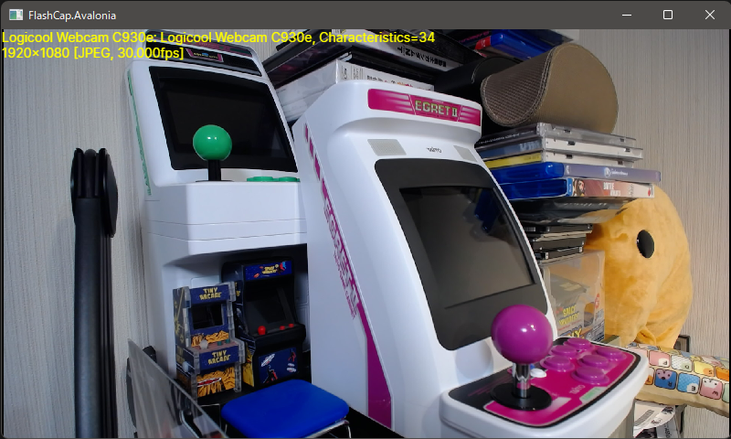
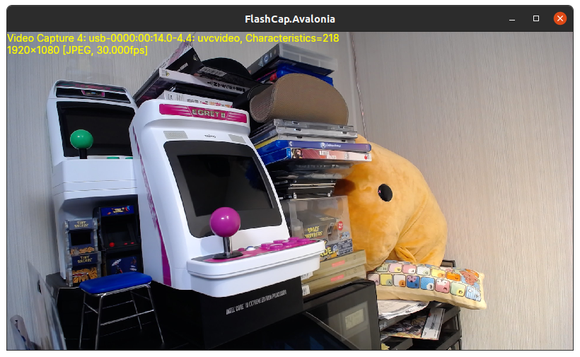

# FlashCap


FlashCap - シンプルで依存性のない、カメラキャプチャライブラリ

[](https://www.repostatus.org/#active)

## NuGet

| Package  | NuGet                                                                                                                |
|:---------|:---------------------------------------------------------------------------------------------------------------------|
| FlashCap | [](https://www.nuget.org/packages/FlashCap) |

## CI

| main                                                                                                                                                                 | develop                                                                                                                                                                       |
|:---------------------------------------------------------------------------------------------------------------------------------------------------------------------|:------------------------------------------------------------------------------------------------------------------------------------------------------------------------------|
| [](https://github.com/kekyo/FlashCap/actions?query=branch%3Amain) | [](https://github.com/kekyo/FlashCap/actions?query=branch%3Adevelop) |

----

[English language is here](https://github.com/kekyo/FlashCap)

## これは何?

.NETでカメラキャプチャ機能を実装する必要がありますか？
.NETでのカメラキャプチャライブラリに困っていますか？

このライブラリは、カメラのキャプチャ機能のみに特化したカメラ画像取り込みライブラリです（フレームグラバーと呼ばれることもあります）。
シンプルなAPIで使いやすく、簡素なアーキテクチャで、ネイティブライブラリを含んでいません。
また、公式以外の他のライブラリに依存することもありません。
[NuGetの依存ページを参照して下さい](https://www.nuget.org/packages/FlashCap)

----

## 簡単なコード例

最初に、対象デバイスと映像の特性を列挙します:

```csharp
using FlashCap;

// キャプチャデバイスを列挙します
var devices = new CaptureDevices();

foreach (var descriptor in devices.EnumerateDescriptors())
{
    // "Logicool Webcam C930e: DirectShow device, Characteristics=34"
    // "Default: VideoForWindows default, Characteristics=1"
    Console.WriteLine(descriptor);

    foreach (var characteristics in descriptor.Characteristics)
    {
        // "1920x1080 [JPEG, 30.000fps]"
        // "640x480 [YUYV, 60.000fps]"
        Console.WriteLine(characteristics);
    }
}
```

次に、キャプチャーを実行します:

```csharp
// 映像特性を指定して、デバイスを開きます:
var descriptor0 = devices.EnumerateDescriptors().ElementAt(0);

using var device = await descriptor0.OpenAsync(
    descriptor0.Characteristics[0],
    async bufferScope =>
    {
        // 引数に渡されるピクセルバッファにキャプチャされている:

        // イメージデータを取得 (恐らくDIB/JPEG/PNGフォーマットのバイナリ):
        byte[] image = bufferScope.Buffer.ExtractImage();

        // 後はお好きに...
        var ms = new MemoryStream(image);
        var bitmap = Bitmap.FromStream(ms);

        // ...
    });

// 処理を開始:
device.Start();

// ...

// 処理を停止:
device.Stop();
```

Reactive Extensionを使う事も出来ます:

```csharp
// 映像特性を指定して、デバイスを開きます:
using var device = await descriptor0.AsObservableAsync(
    descriptor0.Characteristics[0]);

// デバイスをサブスクライブします
device.Subscribe(bufferScope =>
{
    // 引数に渡されるピクセルバッファにキャプチャされている:

    // イメージデータを取得 (恐らくDIB/JPEG/PNGフォーマットのバイナリ):
    byte[] image = bufferScope.Buffer.ExtractImage();

    // 後はお好きに...
    var ms = new MemoryStream(image);
    var bitmap = Bitmap.FromStream(ms);

    // ...
});

// 処理を開始:
device.Start();
```

解説記事はこちら（英語）: ["Easy to implement video image capture with FlashCap" (dev.to)](https://dev.to/kozy_kekyo/easy-to-implement-video-image-capture-with-flashcap-o5a)

----

## 動作環境


対応する.NETプラットフォームは以下の通りです（ほぼ全てです！）:

* .NET 6, 5 (`net6.0`, `net5.0`)
* .NET Core 3.1, 3.0, 2.2, 2.1, 2.0 (`netcoreapp3.1` and etc)
* .NET Standard 2.1, 2.0, 1.3 (`netstandard2.1` and etc)
* .NET Framework 4.8, 4.6.1, 4.5, 4.0, 3.5 (`net48` and etc)

カメラデバイスが使用できるプラットフォーム:

* Windows (DirectShowデバイス, x64/x86)
* Windows (Video for Windowsデバイス, x64/x86)
* Linux (V4L2デバイス, x86_64/i686/aarch64/armv7l/mips)

## テスト済みデバイス

サンプルコードを動作させて確認(0.11.0)。

確認したキャプチャユニット/カメラ:

* Elgato CamLink 4K (Windows/Linux)
* BlackMagic Design ATEM Mini Pro (Windows/Linux)
* Logitech WebCam C930e (Windows/Linux)
* eMeet HD Webcam C970L (Windows/Linux)
* Microsoft LifeCam Cinema HD720 (Windows/Linux)
* Unnamed cheap USB capture module (Windows/Linux)

確認したコンピューター:

* Generic PC Core i9-9960X (x64, Windows)
* Generic PC Core i9-11900K (x64, Linux)
* Microsoft Surface Go Gen1 内蔵カメラ (x64, Windows)
* VAIO Z VJZ131A11N 内蔵カメラ (x64, Windows)
* clockworks DevTerm A06 (aarch64, Linux)
* Raspberry Pi 400 (armv7l/aarch64, Linux)
* Seeed reTerminal (armv7l, Linux, mono is unstable)
* Teclast X89 E7ED Tablet PC 内蔵カメラ (x86, Windows)
* NVIDIA Jetson TX2 評価ボード (aarch64, Linux)
* Acer Aspire One ZA3 inside camera (i686, Linux)
* Imagination Creator Ci20 (mipsel, Linux)

確認した、動作しない環境:

* Surface2 (arm32, Windows RT 8.1 JB'd)
  * デバイスが見つかりませんでした。VFWとDirectShowの両方に対応していない可能性があります。

----

## 完全なサンプルコード

完全なサンプルコードはこちらです:

* [Windowsフォームアプリケーション](samples/FlashCap.WindowsForms/)
* [Avaloniaアプリケーション](samples/FlashCap.Avalonia/)
* [WPFアプリケーション](samples/FlashCap.Wpf)

Avaloniaのサンプルコードは、単一のコードで、WindowsとLinuxの両方で動作します。ユーザーモードプロセスでリアルタイムにキャプチャを行い、（MJPEGから）ビットマップをデコードし、ウィンドウにレンダリングします。AvaloniaはSkiaを使ったレンダラーを使用しています。かなり高速です。





----

## 実装ガイドライン

以降では、FlashCapを使って、大容量の画像データを処理するための様々な手法を解説します。これは応用例なので、必ず読む必要はありませんが、実装のヒントにはなると思います。

## データコピーの削減

動画を処理するには、大量のデータを扱う必要があります。FlashCapでは、動画の1枚1枚を「フレーム」と呼びます。そして、そのフレームが、1秒当たり60や30回という速さでやって来ます。

ここで重要になるのが、各フレームのデータを、いかにコピーする事なく処理できるか、という事です。現在のFlashCapは、最低1回のコピーが発生します。しかし、使用方法によっては、2回や3回、あるいはそれ以上のコピーが発生してしまう可能性があります。

`OpenAsync`メソッドを呼び出す際のコールバックは、`PixelBufferScope`の引数を渡してきます。この引数に、1回コピーされたフレームのデータが格納されています。ここで、「最も安全」なメソッドである、`CopyImage()` メソッドを呼び出してみます:

```csharp
using var device = await descriptor0.OpenAsync(
  descriptor0.Characteristics[0],
  async bufferScope =>  // <-- `PixelBufferScope` (この時点で1回コピー済み)
  {
    // ここで2回目のコピーが発生する
    byte[] image = bufferScope.Buffer.CopyImage();

    // 結果的に、ここで3回目のコピーが発生する
    var ms = new MemoryStream(image);
    var bitmap = Bitmap.FromStream(ms);

    // ...
  });
```

すると、少なくとも合計2回のコピーが発生することになります。更に、得られた画像データ（`image`）を、`Bitmap.FromStream()`でデコードする事で、結果的に3回のコピーが発生したことになります。

では、最初のコード例である、`ExtractImage()`を使った場合はどうでしょうか:

```csharp
using var device = await descriptor0.OpenAsync(
  descriptor0.Characteristics[0],
  async bufferScope =>  // <-- `PixelBufferScope` (この時点で1回コピー済み)
  {
    // ここで2回目のコピーが発生する（かも知れない）
    byte[] image = bufferScope.Buffer.ExtractImage();

    // Streamに変換する
    var ms = new MemoryStream(image);
    // デコードする。結果的に、ここで2回目、又は3回目のコピーが発生する
    var bitmap = Bitmap.FromStream(ms);

    // ...
  });
```

「コピーが発生する（かも知れない）」と言うのは、状況によっては、コピーが発生しない場合がある、という事です。そうであれば、`CopyImage()` を使わずに、`ExtractImage()`だけを使えば良い、と考えるかも知れません。しかし、`ExtractImage()`の場合は、得られたデータの有効期限が短い、と言う問題があります。

以下のようなコードを考えます:

```csharp
// コールバックのスコープ外に画像データを保存
byte[]? image = null;

using var device = await descriptor0.OpenAsync(
  descriptor0.Characteristics[0],
  bufferScope =>  // <-- `PixelBufferScope` (この時点で1回コピー済み)
  {
    // スコープ外に保存（2回目のコピー）
    image = bufferScope.Buffer.CopyImage();
    //image = bufferScope.ExtractImage();  // 危険!!!
  });

// スコープ外で使う
var ms = new MemoryStream(image);
// デコードする（3回目のコピー）
var bitmap = Bitmap.FromStream(ms);
```

このように、`CopyImage()`でコピーしていれば、コールバックのスコープ外でも安全に参照する事が出来ます。しかし、`ExtractImage()`を使った場合は、スコープ外で参照すると、画像データが破損している可能性があるため、注意が必要です。

同様に、`ReferImage()`メソッドを使うと、基本的にコピーが発生しません。（トランスコードが発生する場合を除きます。後述。）この場合も、スコープ外での参照は行えません。また、画像データはバイト配列ではなく、
`ArraySegment<byte>` で参照する事になります。

この型は、配列の部分参照を示しているため、そのまま使用する事が出来ません。例えば、`Stream`として使用したい場合は、以下のようにします:

```csharp
using var device = await descriptor0.OpenAsync(
  descriptor0.Characteristics[0],
  async bufferScope =>  // <-- `PixelBufferScope` (この時点で1回コピー済み)
  {
    // ここでは基本的にコピーが発生しない
    ArraySegment<byte> image =
      bufferScope.Buffer.ReferImage();

    // Streamに変換する
    var ms = new MemoryStream(
      image.Array, image.Offset, image.Count);
    // デコードする（2回目のコピー）
    var bitmap = Bitmap.LoadFrom(ms);

    // ...
  });
```

`MemoryStream`を使う場合は、このコード例と同様の拡張メソッド `AsStream()` が定義されているので、こちらを使用しても良いでしょう。また、SkiaSharpを使う場合は、`SKBitmap.Decode()`を使って、直接`ArraySegment<byte>`を渡す事が出来ます。

ここまでで説明した、画像データを取得する方法の一覧を示します:

| メソッド              | 速度        | スコープ外 | イメージの型               |
|:-----------------|:----------|:--------|:---------------------|
| `CopyImage()`    | 遅い        | 安全 | `byte[]`             |
| `ExtractImage()` | 場合によっては遅い | 使用不可 | `byte[]`             |
| `ReferImage()`   | 高速        | 使用不可 | `ArraySegment<byte>` |

`ReferImage()`を使用すれば、最低2回のコピーで実現することが分かりました。では、1回まで短縮するにはどうすれば良いでしょうか？

1回のコピーだけで実現するには、画像データのデコードを諦める必要があります。もしかしたら、画像データをハードウェアで処理できる環境であれば、画像データを直接、ハードウェアに渡すことで、2回目のコピーをオフロードできるかも知れません。

ここでは分かりやすい例として、以下のように、画像データを直接ファイルに保存する操作を考えます。この場合、デコードも行わないので、コピーは1回という事になります。（その代わり、I/O操作は途方もなく遅いのですが...）

```csharp
using var device = await descriptor0.OpenAsync(
  descriptor0.Characteristics[0],
  async bufferScope =>  // <-- `PixelBufferScope` (この時点で1回コピー済み)
  {
    // ここでは基本的にコピーが発生しない
    ArraySegment<byte> image = bufferScope.Buffer.ReferImage();

    // 画像データを直接ファイルに出力する
    using var fs = File.Create(
      descriptor0.Characteristics[0].PixelFormat switch
      {
        PixelFormats.JPEG => "output.jpg",
        PixelFormats.PNG => "output.png",
        _ => "output.bmp",
      });
    await fs.WriteAsync(image.Array, image.Offset, image.Count);
    await fs.FlushAsync();
  });
```

## トランスコードについて

デバイスから得られた「生の画像データ」は、私たちが扱いやすい、JPEGやDIBビットマップではない場合があります。一般的に、動画形式の画像データは、MPEGのような連続ストリームではない場合、"MJPEG" (Motion JPEG)や"YUV"と呼ばれる形式です。

"MJPEG"は、中身が完全にJPEGと同じであるため、FlashCapはそのまま画像データとして返します。対して、"YUV"形式の場合は、データヘッダ形式はDIBビットマップと同じですが、中身は完全に別物です。従って、これをそのまま "output.bmp" のようなファイルで保存しても、多くの画像デコーダはこれを処理できません。

そこで、FlashCapは、"YUV"形式の画像データの場合は、自動的に"RGB" DIB形式に変換します。この処理の事を「トランスコード」と呼んでいます。先ほど、`ReferImage()`は「基本的にコピーが発生しない」と説明しましたが、"YUV"形式の場合は、トランスコードが発生するため、一種のコピーが行われます。（FlashCapはトランスコードをマルチスレッドで処理しますが、それでも画像データが大きい場合は、性能に影響します。）

もし、画像データが"YUV"形式であっても、そのままで問題ないのであれば、トランスコードを無効化することで、コピー処理を完全に1回のみにする事が出来ます:

```csharp
// トランスコードを無効にしてデバイスを開く:
using var device = await descriptor0.OpenAsync(
  descriptor0.Characteristics[0],
  false,   // transcodeIfYUV == false
  async buferScope =>
  {
      // ...
  });

// ...
```

## コールバックハンドラと呼び出し契機

これまで説明してきたコールバックハンドラは、呼び出される契機が「フレームが得られた時」としていましたが、この契機をいくつかのパターンから選択する事が出来ます。この選択は、`isScattering`と`maxQueuingFrames`の引数で指定可能で、`OpenAsync`のオーバーロード引数で指定します:

```csharp
// ハンドラの呼び出し契機を指定する:
using var device = await descriptor0.OpenAsync(
  descriptor0.Characteristics[0],
  true,
  true,   // 呼び出し契機の指定 (true: Scattering)
  10,     // 最大滞留フレーム数
  async buferScope =>
  {
      // ...
  });

// ...
```

以下に、パターンの種類を示します:

| `isScattering` | `maxQueuingFrames` | 概要 |
|:----|:----|:----|
| false | 1 | 引数省略時（デフォルト）の呼び出し契機。ハンドラが制御を返さない限り、後続のフレームを全て破棄する。一般的な使用方法に最適。 |
| false | n | ハンドラが制御を返さない場合でも、後続のフレームはキューに蓄えられる。コンピューターの性能が十分であれば、最大滞留フレーム数までは失わない。 |
| true | n | ハンドラは、マルチスレッドワーカーによって、並列処理される。対応するフレームの順序が保障されないが、CPUがマルチコアに対応していれば、処理を高速化出来る。 |

デフォルトの呼び出し契機は、多くの場合にとって適切です。例えば、画像をUIでプレビュー状況で、滞留フレーム数に過大な値を指定した場合、ハンドラの処理が遅いと、キューに古い画像データが保持されてしまい、現在のポーズとプレビューがどんどん乖離してしまいます。また、いつかプロセスがメモリ不足で強制終了する事になります。

同様に、`isScattering == true` を使いこなすのは、より難しくなります。あなたが書いたハンドラは、マルチスレッドで同時に呼び出されて、処理されます。従って、少なくともハンドラはスレッドセーフとなるように実装する必要があります。また、マルチスレッドで呼び出されるという事は、処理するバッファは、必ずしも順序が維持されない可能性があるという事です。例えば、UIにプレビューを表示する場合、動画が一瞬過去に戻ったり、ぎこちなく感じるはずです。

`isScattering == true` でフレームの順序が分からなくなる事に対処するため、`PixelBuffer`クラスには、`Timestamp`プロパティと`FrameIndex`プロパティが定義されています。これらのプロパティを参照すれば、フレーム順序の判定を行う事が出来ます。

## Reactive extensionの問題

ところで、`OpenAsync()`のハンドラ引数に、`PixelBufferArrivedDelegate`と`PixelBufferArrivedTaskDelegate`の両方のオーバーロードが存在する事に気が付いていますか？ これは、同期バージョンと非同期バージョンのハンドラ実装にそれぞれ対応していて、どちらでも正しくハンドラ処理の完了を認識するためです。

しかし、`AsObservableAsync()`の場合、ハンドラ実装に該当するのは、Reactive Extensionの`OnNext()`メソッドであり、これは同期バージョンしか存在しません。つまり、Reactive Extensionを使う場合は、オブザーバーの実装に非同期処理は使えません。`async void OnNext(...)`とマークする事で実装は可能ですが、ピクセルバッファの有効期限が、最初の`await`の直前までであることに十分注意して下さい。コンパイラはこの問題を検出できません。

最も安全な方法として、出来るだけ早く、ピクセルバッファから画像データを取り出す（コピーしてしまう）事でしょう。これは、射影演算子を使って簡単に実現できます:

```csharp
device.
    // すぐに射影する
    Select(bufferScope =>
        Bitmap.FromStream(bufferScope.Buffer.ReferImage().AsStream())).
    // 後はお好きに...
    // ...
```

## フレームプロセッサをマスターする (Advanced topic)

地下ダンジョンへようこそ。FlashCapのフレームプロセッサは、磨けば光る宝石です。しかし、余程のことが無い限り、フレームプロセッサを理解する必要はありません。この解説は、やむを得ずフレームプロセッサを扱う場合の参考にして下さい。また、FlashCapが[デフォルトで内蔵するフレームプロセッサの実装](https://github.com/kekyo/FlashCap/tree/main/FlashCap/FrameProcessors)も参考になるでしょう。

前節で解説した、コールバックハンドラの呼び出し契機は、内部的にはフレームプロセッサを切り替える事によって実現されています。つまり、フレームをどのように取り扱うのかや、その振る舞いを抽象化したものです。

フレームプロセッサは、非常に単純な基底クラスを継承して実装します:

```csharp
// (細かい定義は省きます)
public abstract class FrameProcessor : IDisposable
{
  // 必要なら実装する
  public virtual void Dispose()
  {
  }

  // ピクセルバッファを取得する
  protected PixelBuffer GetPixelBuffer()
  { /* ... */ }

  // ピクセルバッファを返却する
  public void ReleasePixelBuffer(PixelBuffer buffer)
  { /* ... */ }

  // デバイスを使用してキャプチャを実行する
  protected void Capture(
    CaptureDevice captureDevice,
    IntPtr pData, int size,
    long timestampMicroseconds, long frameIndex,
    PixelBuffer buffer)
  { /* ... */ }

  // フレームが到達した際に呼び出される
  public abstract void OnFrameArrived(
    CaptureDevice captureDevice,
    IntPtr pData, int size, long timestampMicroseconds, long frameIndex);
}
```

少なくとも実装する必要があるのは、`OnFrameArrived()`メソッドです。これは、文字通りフレームが到達した時に呼び出されます。シグネチャを見れば分かる通り、生のポインタと画像データのサイズ、タイムスタンプ、そしてフレーム番号が渡されます。

戻り値が`void`である事にも注意して下さい。このメソッドは非同期処理に出来ません。`async void`で修飾したとしても、引数で渡される情報が維持できません。

このメソッドの、典型的な実装例を示します:

```csharp
public sealed class CoolFrameProcessor : FrameProcessor
{
  private readonly Action<PixelBuffer> action;

  // キャプチャしたら実行するデリゲートを保持する
  public CoolFrameProcessor(Action<PixelBuffer> action) =>
    this.action = action;

  // フレームが到達した際に呼び出される
  public override void OnFrameArrived(
    CaptureDevice captureDevice,
    IntPtr pData, int size, long timestampMicroseconds, long frameIndex)
  {
    // ピクセルバッファを取得する
    var buffer = base.GetPixelBuffer();

    // キャプチャを実行する
    // ピクセルバッファに画像データが格納される (最初のコピーが発生)
    base.Capture(
      captureDevice,
      pData, size,
      timestampMicroseconds, frameIndex,
      buffer);

    // デリゲートを呼び出す
    this.action(buffer);

    // ピクセルバッファを返却する（任意。割り当てられたバッファを再利用します）
    base.ReleasePixelBuffer(buffer);
  }
}
```

このメソッドが、フレーム到達時に毎回呼び出されることを思い出してください。つまり、この実装例は、フレーム到達毎にピクセルバッファを生成し、キャプチャし、そしてデリゲートを呼び出します。

ではこれを使ってみます:

```csharp
var devices = new CaptureDevices();
var descriptor0 = devices.EnumerateDevices().ElementAt(0);

// フレームプロセッサを指定してオープンする
using var device = await descriptor0.OpenWitFrameProcessorAsync(
  descriptor0.Characteristics[0],
  true,   // transcode
  new CoolFrameProcessor(buffer =>   // カスタムのフレームプロセッサを使う
  {
    // キャプチャされたピクセルバッファが渡される
    var image = buffer.ReferImage();

    // デコードする
    var bitmap = Bitmap.FromStream(image.AsStream());

    // ...
  });

device.Start();

// ...
```

あなたの最初のフレームプロセッサを動かす準備が出来ました。そして、実際に動かさなくても、特徴と問題に気が付いていると思います:

* デリゲートは、フレーム到達時に最短で呼び出される。（呼び出されるところまでは最速である。）
* デリゲートの処理が完了するまで、`OnFrameArrived()`がブロックされる。
* デリゲートは、同期処理を想定している。そのため、デコード処理に時間がかかり、スレッドをブロックすると、容易にフレームドロップが発生する。
* もしここで、ブロックを回避するために`async void`を使用すると、デリゲートの完了を待てないので、ピクセルバッファへのアクセスは危険にさらされる。

このような理由で、FlashCapでは、ある程度安全に操作できる、標準のフレームプロセッサ群を使用するようになっています。では、カスタムフレームプロセッサを実装する利点がどこにあるのでしょうか？

それは、きわめて高度に最適化された、フレームと画像データの処理を実装できることです。例えば、ピクセルバッファは効率よく作られていますが、必ず使用しなければならないわけではありません。（`Capture()`メソッドの呼び出しは任意です。）引数によって、生の画像データへのポインタとサイズが与えられているため、画像データに直接アクセスすることは可能です。そこで、あなた独自の画像データ処理を実装すれば、最速の処理を実現する事が出来ます。

----

## 制限

* Video for Windowsでは、プログラムで「ソースデバイス」を選択することはできません。VFWの論理構成は:
  1. VFWデバイスドライバ(常に1つのドライバのみ、最新のWindowsではデフォルトのWDMデバイス): `ICaptureDevices.EnumerateDevices()` がこのデバイスを列挙します。
  2. ソースデバイス（本当のカメラデバイス）に対応する各ドライバ。しかし、プログラマブルに選択することはできません。
     複数のカメラデバイスが検出された場合、自動的に選択ダイアログが表示されます。

----

## License

Apache-v2.

----

## 履歴

* 1.2.0:
  * `AsObservableAsync()`で、Reactive Extensionに対応しました。
* 1.1.0:
  * ピクセルバッファプーリングの実装をFrameProcessorの基底クラスに移動しました。
  * CaptureDeviceでIDisposableが実装されていないのを修正。
* 1.0.0:
  * Reached 1.0.0 🎉
  * V4L2のmiplel環境をサポート。
  * 予定していた全ての環境でテストを行いました。
  * WPFのサンプルプロジェクトを追加しました。
  * サンプルプロジェクトでgraceful shutdownを反映させました。
* 0.15.0:
  * V4L2関係のブリッジコードの書き換えを完了し、i686でのV4L2の動作を修正した。
  * 完全非同期動作にしたため、net20のサポートを廃止。
  * `OpenAsync`に`maxQueuingFrames`を指定できるように変更しました。
* 0.14.0:
  * 内部フレームプロセッサで、フレーム到達ハンドラがDispose処理中に暗黙のデッドロックを起こした場合の問題を回避するようにしました。
* 0.12.0:
  * Openメソッドにトランスコードフラグを指定するオーバーロードを追加。
  * 内部フレームプロセッサの安全なシャットダウンを実装しました。
  * トランスコーディングにプロセッサカウントを適用。
  * タイムスタンプの計算コストを削減し、リソースの少ない環境にも対応。
  * `FrameIndex`プロパティを追加。
* 0.11.0:
  * `PixelBufferScope` を追加し、ピクセルバッファを早期に解放することが出来るようにした。
  * `IsDiscrete` を追加し、デバイスによって定義された画像特性かどうかを判別出来るようにした。
  * 様々なデバイスとコンピューターで動作検証を行い、不具合を修正。
* 0.10.0:
  * フレームプロセッサを実装し、より使いやすく、拡張性のあるフレーム/ピクセル取得方法を実装できるようにしました。
  * イベントベースのインターフェイスを削除し、コールバックのインターフェイスを追加しました。
  * net35/net40 プラットフォームでサポートする非同期メソッドを追加しました (公式の非同期パッケージが必要です)。
  * net461 以上のプラットフォームでサポートする ValueTask非同期メソッドを追加しました (公式の非同期パッケージが必要です)。
  * 同期と非同期のメソッドを完全に分離しました。
  * インターフェース型を削除しました。
  * mono-linux環境でランダムに例外が発生するのを修正。
  * (1.0.0までもうすぐです)
* 0.9.0:
  * Linux V4L2に対応しました 🎉
* 0.8.0:
  * フレームレート計算を改善しました。
  * より簡単に画像を撮影できるメソッド `CaptureOneShot` を追加しました。
  * ビデオ特性のインターフェイスを変更しました(フレームレートとピクセルフォーマット関連。V4L2の実装を反映)。
* 0.7.0:
  * DirectShowで無効なビデオフレームを送信するビデオデバイスをかわす機能を改善しました。
  * 32bit環境でRtlCopyMemoryのエントリポイントが見つからない問題を修正しました。
  * LimitedExecutorクラスを追加しました。
* 0.6.0:
  * DirectShowデバイスをサポート 🎉
  * STAスレッドを分離して使用するVFWの安定性を向上させました。
* 0.5.0:
  * netstandard1.3を再有効化しました。
  * より便利なメソッドとインタフェースを追加しました。
  * VFWで無効なビデオフレームを送信するビデオデバイスをかわす機能を改善しました。
  * メディアタイプ構造へのアクセスの不具合を修正しました。
* 0.4.0:
  * DirectShow APIを使用した実装 (ただし、まだ作業中なので、このバージョンは無効です)
  * バッファの取り扱いを改善しました。
  * フレーム到着イベントでのアロケーションを廃止。
  * 到着した画像が jpeg/mjpeg の場合、トランスコードされたデータが不正になるのを修正。
  * VFWホストウィンドウが本当にデスクトップ領域外にある場合、フレーム到着イベントを呼び出さないように修正しました。
* 0.3.0:
  * 共通のデバイス列挙を実装。
  * サポートデバイスの特性列挙を追加。
  * DirectShowとV2L2の為に、インターフェイスメンバーのブラッシュアップ。
* 0.2.0:
  * YUV変換式をMSの技術論文に準拠させました。
  * PixelBufferをスレッドセーフにしました。
* 0.1.10:
  * 平行変換時のスキャッターの高さを増加させました。
  * height modがない場合の変換オーバーランを修正しました。
* 0.1.0:
  * 初期リリース。
